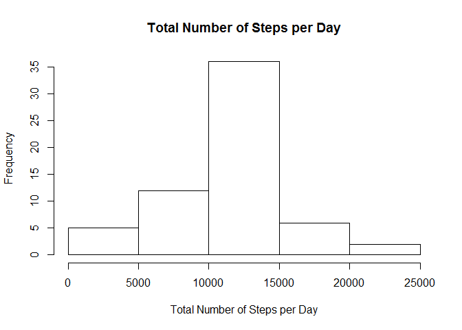
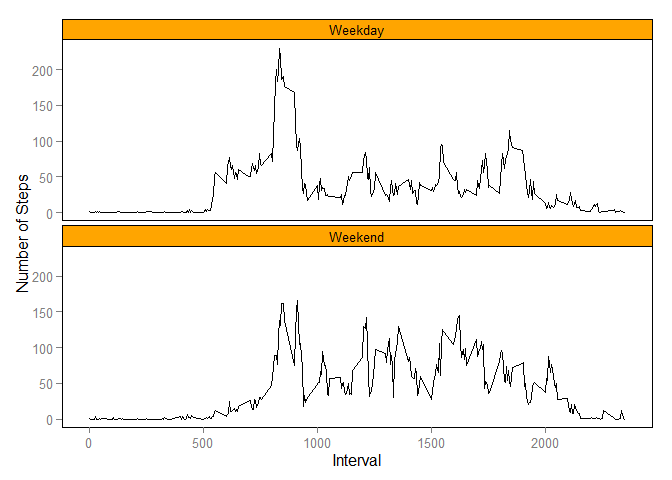

# Reproducible Research: Peer Assessment 1


## Loading and preprocessing the data

```r
activity_data<-read.csv("activity.csv", header=TRUE, sep=",",na.strings="NA")
summary(activity_data)
```

```
##      steps                date          interval     
##  Min.   :  0.00   2012-10-01:  288   Min.   :   0.0  
##  1st Qu.:  0.00   2012-10-02:  288   1st Qu.: 588.8  
##  Median :  0.00   2012-10-03:  288   Median :1177.5  
##  Mean   : 37.38   2012-10-04:  288   Mean   :1177.5  
##  3rd Qu.: 12.00   2012-10-05:  288   3rd Qu.:1766.2  
##  Max.   :806.00   2012-10-06:  288   Max.   :2355.0  
##  NA's   :2304     (Other)   :15840
```


## What is mean total number of steps taken per day?
### Total number of steps taken per day

```r
total_steps<-aggregate(steps~date, data=activity_data, sum)
hist(total_steps$steps, main="Total Number of Steps per Day", xlab="Total Number of Steps per Day")
```

 

### Mean and median of the total number of steps taken per day

```r
mean(total_steps$steps,na.rm=TRUE)
```

```
## [1] 10766.19
```

```r
median(total_steps$steps,na.rm=TRUE)
```

```
## [1] 10765
```

```r
total_mean<-mean(total_steps$steps,na.rm=TRUE)
total_median<-median(total_steps$steps,na.rm=TRUE)
```
The mean of the total number of steps taken per day is 1.0766189\times 10^{4} and the median is 10765.

## What is the average daily activity pattern?
### Time series plot

```r
avg_steps<-aggregate(steps~interval, data=activity_data, mean)
plot(avg_steps$interval, avg_steps$steps, type="l", xlab="Interval", ylab="Average Steps", col="Blue")
```

 

### The 5-minute interval with maximum number of steps

```r
max_avgsteps<-max(avg_steps$steps)
avg_steps$interval[avg_steps$steps==max_avgsteps]
```

```
## [1] 835
```

## Imputing missing values
### Total number of missing values in the dataset

```r
total_missing<-length(activity_data[is.na(activity_data)])
```
Total number of missing values in the dataset is 2304.

### Impute the missing values and make a histogram
The missing values are imputed by the mean of the same 5-minute interval.

```r
new_data<-activity_data
for(i in 1:dim(new_data)[1]) {
  if(is.na(new_data$steps[i])) {
    new_data[i,1]<-avg_steps[avg_steps$interval==new_data[i,3],2]
  }
}
total_steps2<-aggregate(steps~date, data=new_data, sum)
hist(total_steps2$steps, main="Total Number of Steps per Day", xlab="Total Number of Steps per Day")
```

 

### Mean and median of the total number of steps taken per day based on the imputed data

```r
mean(total_steps2$steps,na.rm=TRUE)
```

```
## [1] 10766.19
```

```r
median(total_steps2$steps,na.rm=TRUE)
```

```
## [1] 10766.19
```

### The impacts of data imputation on the mean and median of the total number of steps taken per day

```r
mean_change<-mean(total_steps2$steps,na.rm=TRUE)-mean(total_steps$steps,na.rm=TRUE)
median_change<-median(total_steps2$steps,na.rm=TRUE)-median(total_steps$steps,na.rm=TRUE)
```
The change in the mean of the total number of steps taken per day is 0, and the change in the median of the total number of steps taken per day is 1.1886792. 

## Are there differences in activity patterns between weekdays and weekends?

```r
library(ggplot2)
weekday<-c('Monday', 'Tuesday', 'Wednesday','Thursday', 'Friday')
new_data$dayofweek<-factor((weekdays(as.Date(new_data$date)) %in% weekday), levels=c(TRUE,FALSE),labels=c('Weekday','Weekend'))
avg_steps2<-aggregate(steps~interval+dayofweek, data=new_data, mean)
g<-ggplot(avg_steps2, aes(x=interval, y=steps, group=dayofweek))
g+geom_line()+facet_wrap(~dayofweek,ncol=1)+
  labs(x="Interval", y="Number of Steps")+theme(panel.background=element_rect(fill='white', colour='black'),strip.background=element_rect(fill='orange', colour='black'),panel.grid.major = element_blank(), panel.grid.minor = element_blank())
```

 

